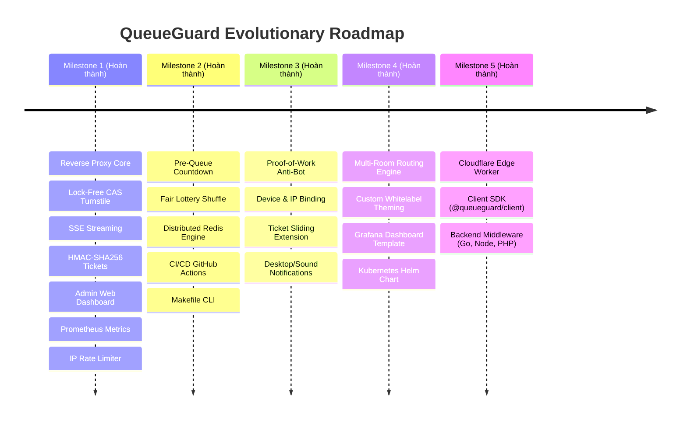

# 🗺️ QueueGuard — Kế Hoạch Phát Triển Tương Lai (Development Roadmap & Backlog)

Tài liệu này tổng hợp toàn bộ các tính năng tiềm năng, kiến trúc mở rộng và các hạng mục kỹ thuật còn có thể nâng cấp cho dự án **QueueGuard** để đưa sản phẩm từ giải pháp Core Reverse Proxy lên tầm **Enterprise-Grade Traffic Shaper** hoàn chỉnh.

---

## 🧭 Ma Trận Ưu Tiên Phát Triển (Feature Priority Matrix)

| Mức Độ | Tính Năng | Mô Tả Tóm Tắt | Lợi Ích Cốt Lõi | Trạng Thái |
| :---: | :--- | :--- | :--- | :---: |
| **P0 (Cao)** | **CAPTCHA & Proof-of-Work (PoW)** | Buộc client giải toán SHA-256 hoặc xác thực Cloudflare Turnstile | Triệt tiêu 99.9% botnet quy mô lớn trước khi vào hàng | ✅ Hoàn thành |
| **P0 (Cao)** | **Ràng Buộc Vé Chống Bán Lại (Device Binding)** | Khóa vé theo Device Fingerprint / Hash User-Agent + IP subnet | Ngăn chặn nạn đầu cơ, mua gom và chuyển nhượng vé | ✅ Hoàn thành |
| **P1 (Trung)** | **Gia Hạn Vé Động (Sliding Window Extension)** | Hỗ trợ header `X-QueueGuard-Extend` từ origin kéo dài TTL vé | Đảm bảo không đứt quãng luồng thanh toán / checkout | ✅ Hoàn thành |
| **P1 (Trung)** | **Desktop & Sound Notification API** | Chuông báo âm thanh Web Audio và Web Push khi đến lượt vào web | Tránh tình trạng khách bỏ quên tab dẫn đến hết hạn vé | ✅ Hoàn thành |
| **P1 (Trung)** | **Hỗ Trợ Đa Phòng Chờ (Multi-Room Routing)** | Cấu hình nhiều phòng chờ độc lập (`/vip`, `/regular`, `/flashsale`) | Phục vụ các sự kiện có nhiều phân khúc vé và URL khác nhau | ✅ Hoàn thành |
| **P1 (Trung)** | **Tùy Biến Giao Diện Thương Hiệu (Whitelabel / Theme)** | Cho phép cấu hình Logo, màu sắc, i18n đa ngôn ngữ, template ngoài | Nâng cao trải nghiệm người dùng, hiển thị quảng cáo tài trợ | ✅ Hoàn thành |
| **P2 (Dài hạn)** | **Grafana Dashboard Template & OpenTelemetry** | File JSON mẫu cho Grafana và OTel Tracing | Quan sát chi tiết độ trễ, phân bố địa lý của hàng chờ | ✅ Hoàn thành |
| **P2 (Dài hạn)** | **Kubernetes Helm Chart & Operator** | Triển khai 1-click lên Kubernetes kèm HPA tự động scale | Sẵn sàng cho môi trường hạ tầng Cloud Native (EKS, GKE, AKS) | ✅ Hoàn thành |
| **P2 (Dài hạn)** | **WASM Envoy / Cloudflare Filter** | Đưa logic xác thực vé ra chạy tại CDN Edge bằng WebAssembly | Giảm tải 100% cho origin khi vé chưa hợp lệ | ✅ Hoàn thành |
| **P2 (Dài hạn)** | **Client & Middleware SDK (@queueguard/client-js)** | Thư viện React/Vue hook và backend middleware cho Node/Go/PHP | Tích hợp tiện lợi không cần bọc reverse proxy | ✅ Hoàn thành |

---

## 🛠️ Chi Tiết Các Hạng Mục Nâng Cấp

### 1. 🛡️ Chống Bot Nâng Cao: Proof-of-Work (PoW) & CAPTCHA
* **Vấn đề**: Các mạng botnet phân tán (DDoS botnet với hàng vạn IP sạch) có thể vượt qua IP Rate Limiter.
* **Giải pháp**:
  - **Client-side Proof-of-Work**: Khi mở tab phòng chờ, trình duyệt chạy Web Worker giải bài toán mật mã (ví dụ: tìm chuỗi nonce sao cho `SHA256(challenge + nonce)` bắt đầu bằng `0000`).
    - *Đối với người dùng thật*: Mất ~0.2 giây CPU, hoàn toàn không cảm nhận được độ trễ.
    - *Đối với Botnet*: Chi phí CPU tăng gấp 10.000 lần, khiến bot bị kiệt quệ tài nguyên khi chạy hàng ngàn phiên đồng thời.
  - **Tích hợp Cloudflare Turnstile / hCaptcha**:
    - Chỉ kích hoạt khi hàng chờ đạt mức cảnh báo quá tải (`queue_depth > 5,000`).

---

### 2. 🎟️ Khóa Vé Chống Mua Bán Lại (Device & Network Binding)
* **Vấn đề**: Phe vé (Scalpers) dùng công cụ tự động xếp hàng lấy vé số đẹp, sau đó xuất cookie vé bán lại cho người khác giá cao.
* **Giải pháp**:
  - Trong payload vé HMAC-SHA256 [ticket.go](file:///c:/Users/Admin/queueguard/internal/crypto/ticket.go), bổ sung trường:
    ```go
    type AdmissionTicket struct {
        SessionID    string `json:"sid"`
        QueueNumber  uint64 `json:"qnum"`
        DeviceHash   string `json:"dev"`  // Hash(User-Agent + Accept-Language + ClientSubnet)
        IssuedAt     int64  `json:"iat"`
        ExpiresAt    int64  `json:"exp"`
    }
    ```
  - Khi proxy kiểm tra vé tại `handler.go`, nếu `DeviceHash` của request khác với hash lúc cấp vé -> Hủy vé lập tức và đẩy về cuối hàng.

---

### 3. 🎪 Quản Lý Đa Phòng Chờ (Multi-Waiting Room Engine)
* **Vấn đề**: Website bán vé lớn có nhiều phân khu (ví dụ: Vé VIP, Vé Phổ Thông, Vé Đỗ Xe). Mỗi khu vực cần tốc độ xả vé và URL backend khác nhau.
* **Giải pháp**:
  - Mở rộng cấu hình cho phép khai báo danh sách phòng chờ:
    ```yaml
    rooms:
      - id: "concert-vip"
        path_prefix: "/tickets/vip"
        discharge_rate: 5
        origin_url: "http://origin-vip:8080"
      - id: "concert-general"
        path_prefix: "/tickets/general"
        discharge_rate: 30
        origin_url: "http://origin-general:8080"
    ```
  - Độc lập số thứ tự và tiến trình xả giữa các phòng chờ.

---

### 4. 🎨 Tùy Biến Giao Diện & Trải Nghiệm Người Chờ (UX & Theming)
* **Vấn đề**: Giao diện mặc định dù đẹp nhưng các doanh nghiệp cần hiển thị nhận diện thương hiệu riêng hoặc video teaser sự kiện.
* **Giải pháp**:
  - **Tải giao diện tùy biến (Custom HTML/CSS)**: Cấu hình biến môi trường `WAITING_ROOM_TEMPLATE_PATH=/custom/template.html`.
  - **Hỗ trợ đa ngôn ngữ (i18n)**: Tự động phát hiện ngôn ngữ qua `Accept-Language` (Tiếng Việt, Tiếng Anh, Nhật, Hàn, v.v.).
  - **Âm thanh & Thông báo**:
    - Khi vị trí hàng chờ $< 5$, phát âm thanh nhắc nhở nhẹ.
    - Xin quyền `Notification.requestPermission()` trên trình duyệt để hiện thông báo đẩy Desktop khi đến lượt.

---

### 5. 🔄 Cơ Chế Gia Hạn Vé Động Trên Origin (Sliding Window Extension)
* **Vấn đề**: Hiện tại vé có TTL cố định (mặc định 10 phút). Nếu khách hàng đang thao tác thanh toán thẻ tín dụng bước cuối mà hết 10 phút, họ có thể bị đẩy ngược lại phòng chờ.
* **Giải pháp**:
  - Cung cấp cơ chế **Ticket Heartbeat/Extension**: Khi khách hàng tương tác với backend chính, backend có thể gửi header phản hồi:
    `X-QueueGuard-Extend: 5m`
  - Proxy nhận diện header này và tự động gia hạn TTL của vé thêm 5 phút an toàn mà không bắt khách xếp hàng lại.

---

### 6. 📊 Mẫu Giám Sát Grafana Dashboard & OpenTelemetry
* **Giải pháp**:
  - Cung cấp sẵn file `deploy/grafana/dashboard.json` dựng sẵn các bảng hiển thị đẹp mắt:
    - Biểu đồ biến thiên hàng chờ theo thời gian (Queue Depth Timeseries).
    - Lưu lượng xả thực tế (Throughput Admitted per Second).
    - Tỷ lệ drop / rate-limited IP.
  - Tích hợp OpenTelemetry Tracing (`go.opentelemetry.io/otel`) để đo chính xác thời gian request đi qua Proxy -> Origin.

---

### 7. ☁️ Sẵn Sàng Cho Cloud Native: Kubernetes Helm Chart & Operator
* **Thư mục dự kiến**: `deploy/helm/queueguard`
  - `values.yaml` cấu hình số replica, cấu hình Redis, biến môi trường.
  - Hỗ trợ Kubernetes HPA (Horizontal Pod Autoscaler) tự động scale số pod Proxy khi lưu lượng CPU hoặc kết nối SSE tăng cao.

---

### 8. 📦 Thư Viện SDK Client Phía Trình Duyệt & Backend
* **Client SDK (`@queueguard/client-js`)**:
  - Hook cho React / Vue / Angular:
    ```tsx
    const { position, estSeconds, isAdmitted } = useQueueGuard();
    ```
* **Backend Middleware SDK**:
  - Cho các hệ thống muốn xác thực chữ ký vé trực tiếp trên Origin mà không cần proxy bọc ngoài:
    - Go: `queueguard.VerifyTicket(secret, ticketString)`
    - Node.js / Express: `queueguardMiddleware({ secret: '...' })`
    - PHP / Laravel: `QueueGuard::verify($ticket)`

---

## 📅 Lộ Trình Triển Khai Gợi Ý (Suggested Release Plan)



---

## 🤝 Hướng Dẫn Đóng Góp (Contributing)
1. Fork repository tại [https://github.com/Loccao102/Queueguard](https://github.com/Loccao102/Queueguard).
2. Tạo nhánh tính năng (`git checkout -b feature/amazing-feature`).
3. Đảm bảo chạy pass toàn bộ test suite (`make test`).
4. Tạo Pull Request mô tả chi tiết giải pháp.

